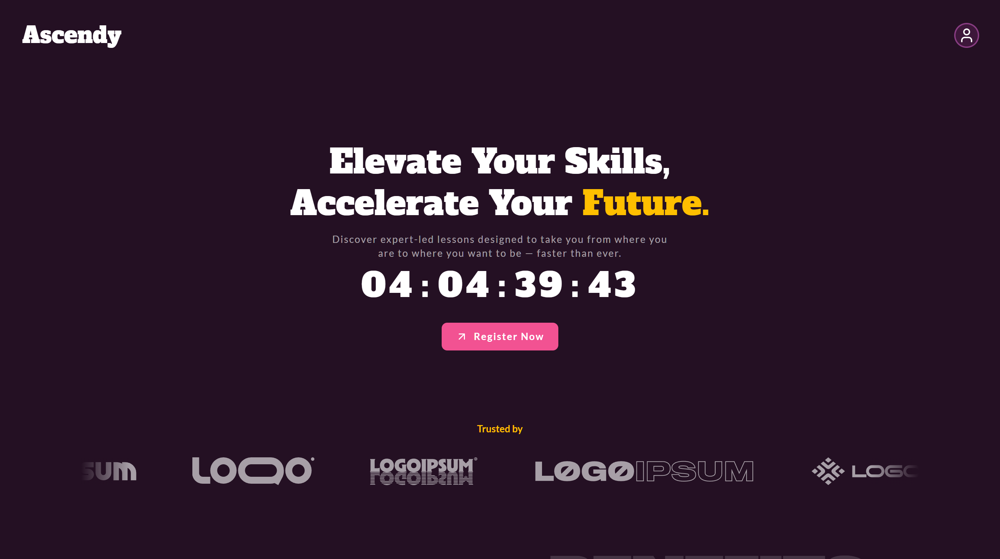

<h3 align="center">
  
  
</h3>

<br/>

## 💻 Technologies 💻

| Category        | Technology                                                                                                      |
| --------------- | --------------------------------------------------------------------------------------------------------------- |
| Frontend        |  |
| Design          |                                 |
| Version Control |                                      |
| Deployment      |                                   |
|                 |                                                                                                                 |

<br/>

## 🔍 Preview 🔍

<i>A raw idea is complex but by having collaboration with us, the experts. it can be refined or simplified.</i>

Press `CTRL` + Click this [Link](https://www.figma.com/design/WxMycqKsbVtKD4s6jUnV4J/Ascendly-Landing-Page?node-id=6-55&t=0BWI6NMjls8Tvucx-1) to see the **_Mock-up file_**.

Press `CTRL` + Click this [Link](https://ascendly-landing-page.vercel.app) to see the **_Live Demo_**.



<br/>

## ⚙️ Prerequisites ⚙️

Before you begin, make sure you have the following installed:

- [Node.js](https://nodejs.org/)
- [npm](https://www.npmjs.com/) or [yarn](https://yarnpkg.com/)
- Git

<br/>

## 🛠️ Installation 🛠️

Clone the repository:

```bash
git clone https://github.com/rutherx44/landing-pages.git
cd landing-pages
cd ascendly
code . # open the current directory.
```

Install dependencies:

```bash
npm install
# or
yarn install
```

<br/>

## ▶️ Usage ▶️

To start the development server:

```bash
npm run dev
# or
yarn dev
```

To build for production:

```bash
npm run build
# or
yarn build
```

<br/>

## 📬 Contact 📬

For questions or feedback, feel free to reach out:

<div>
  <a href="https://linkedin.com/in/ruther-dio" target="_blank">
    
  </a>
  <a href="mailto:ruther.diox04@gmail.com">
    
  </a>
  <a href="https://dribbble.com/rthrx44" target="_blank">
    
  </a>
  <a href="https://www.behance.net/rutherdio" target="_blank">
    
  </a>
  <a href="https://ruther-portfolio.vercel.app/" target="_blank">
    
  </a>
</div>
